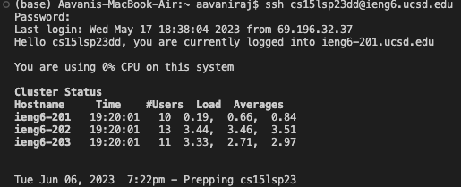
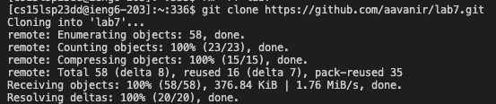
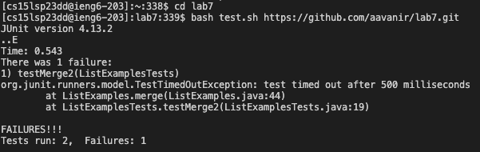
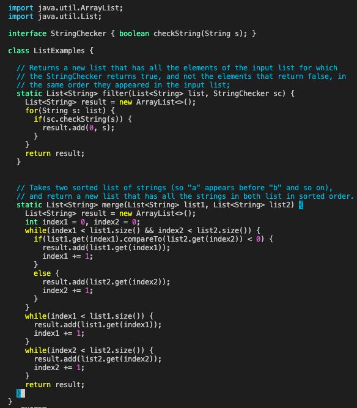
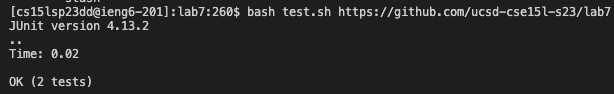
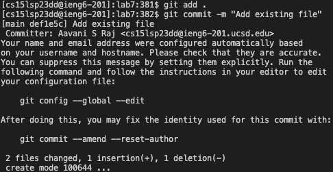
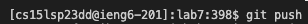

#Lab 4

Step 1: Keys pressed=```<ssh cs15lsp23dd@ieng6.ucsd.edu>```, I typed in ```ssh cs15lsp23dd@ieng6.ucsd.edu``` into the terminal to log into ieng6



Step 2: Keys pressed=```<git clone https://github.com/aavanir/lab7>```, I typed ```git clone https://github.com/aavanir/lab7``` into the terminal to clone my fork of the repository from my Github account



Step 3: Keys pressed=```<cd lab7>, <bash test.sh https://github.com/aavanir/lab7.git>```, I typed ```cd lab7``` to set the current directory to lab7. Then I typed ```bash test.sh https://github.com/aavanir/lab7.git``` into the terminal to run the tests, demonstrating that they fail


  
Step 7: Keys pressed=```<vim ListExamples.java>, <i><delete><2>, <esc><:wq!>```, I typed ```vim ListExamples.java``` into the terminal so that I would be able to edit the code file. I then fixed the failing test and saved the file.



Step 8: Keys pressed=```<up><up><enter>```, The ```<bash test.sh https://github.com/aavanir/lab7.git>``` command was 4 up in the search history, so I used the up arrow to access it.



Step 9: Keys pressed=```<git add .>```, ```<git commit -m "Add new file">```, and ```git push origin``` to commit and push



